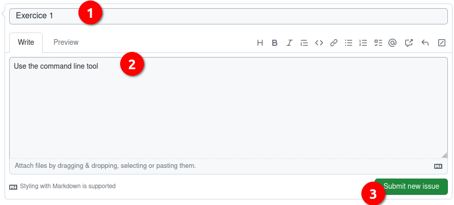

# Exercice 1

Use the command line tool

## Generate a issue in this repository


1. give it the Title : Exercice 1
1. Give it the comment : Use the command line tool
1. Submit it



## Use the command line tool

For each of the items now, you will be asked to do the task and make a screenshot of the result

### Example

- Go to the folder Documents of your home directory

1. Open you terminal
2. enter the necessary command

```
cd Documents
```

Take a screenshot 