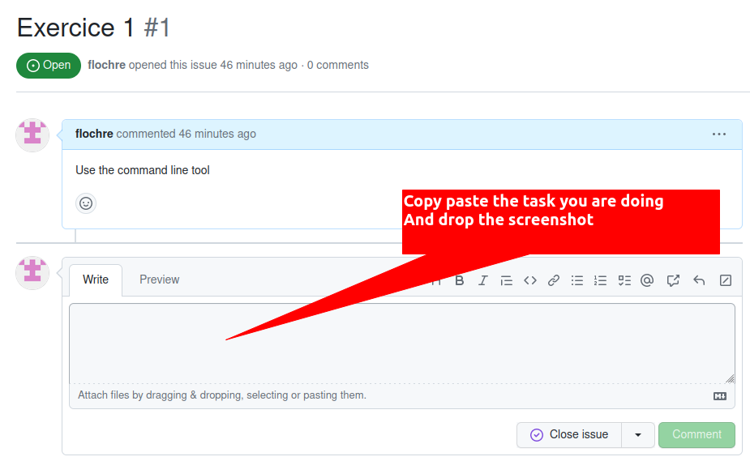
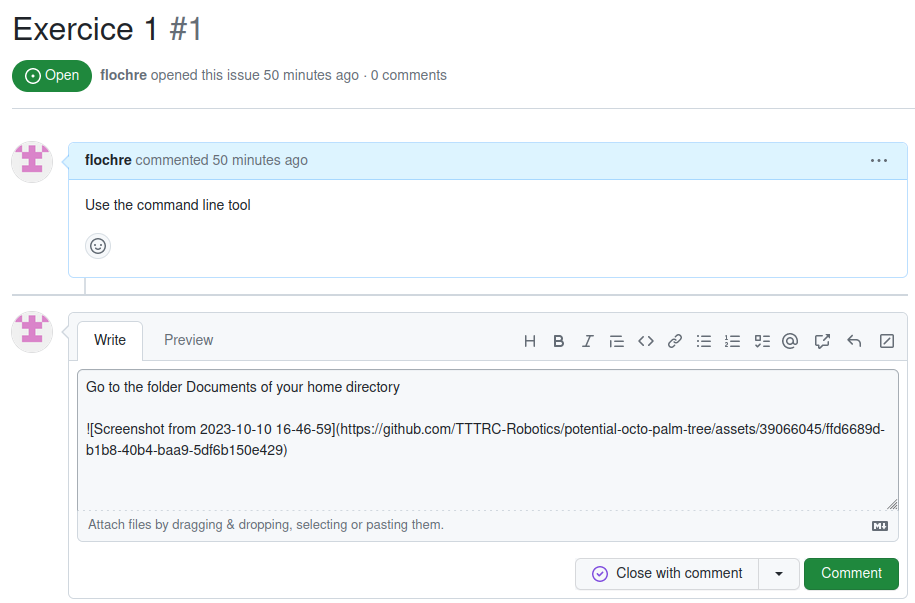
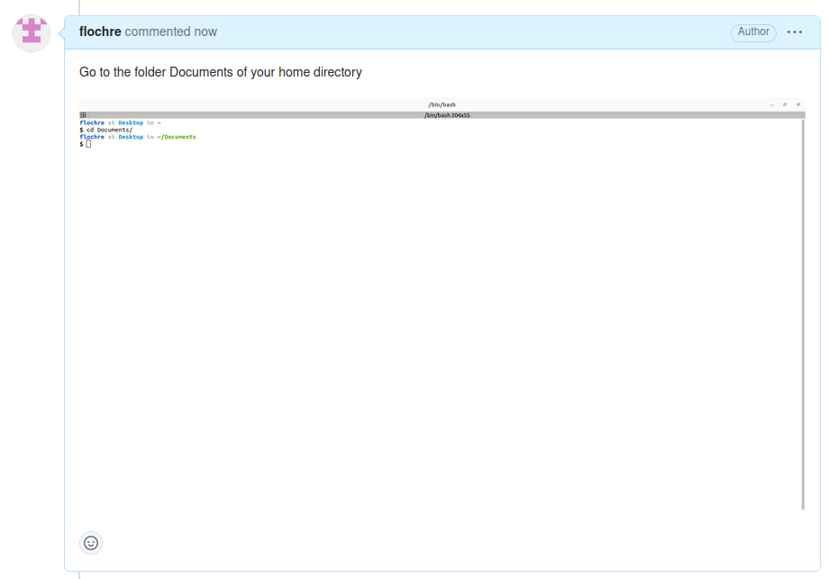

# Exercice 1

In this exercice you will be ask to prove your skills using the terminal

But first I will ask a you to generate a issue in Github with Firefox

## Generate a issue in this repository

1. give it the Title : Exercice 1
1. Give it the comment : Use the command line tool
1. Submit it

## Use the command line tool

For each of the items now, you will be asked to do the task and make a screenshot of the result

### Example

- Go to the folder Documents of your home directory

1. Open you terminal
2. Enter the necessary commands
3. Take a screenshot
4. Add the task and the screenshot to the issue Exercice 1

Add the text and image

after commenting, it should look like this

### Exercice

- Go to the 
- Go to the folder Documents of your home directory
- Go to the folder Downloads of your home directory
- Go to the folder /tmp