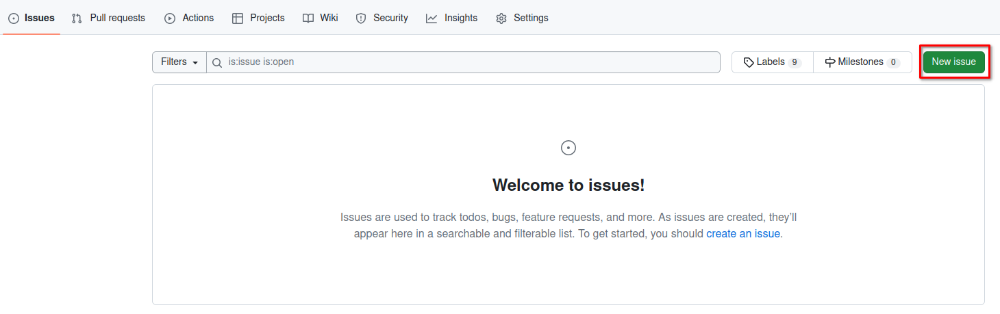
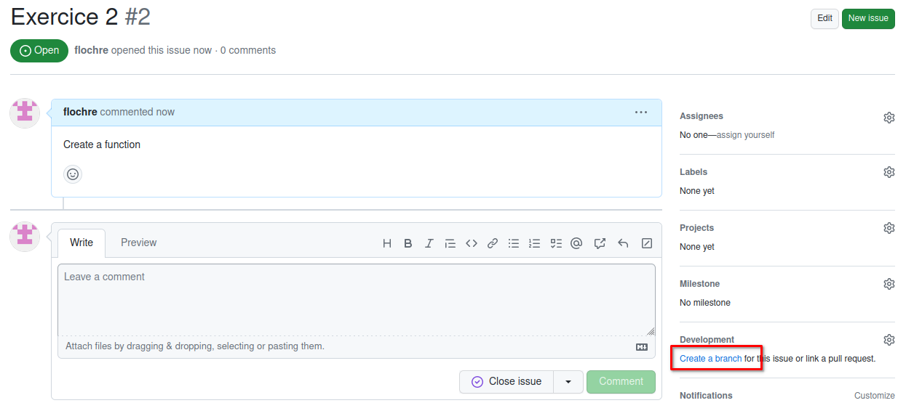

# Exercice 2 

In this exercice, we will make sure, that you are able to create a function and use it.

But first I will ask a you to generate a issue in Github with Firefox

## Generate a issue in this repository

To be able to evaluate the work you will generate a issue and store all the info inside it.

1. Give it the Title : Exercice 2
1. Give it the comment : Create a function
1. Submit it

You should then create a branch from inside the issue

